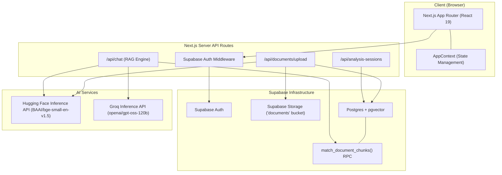
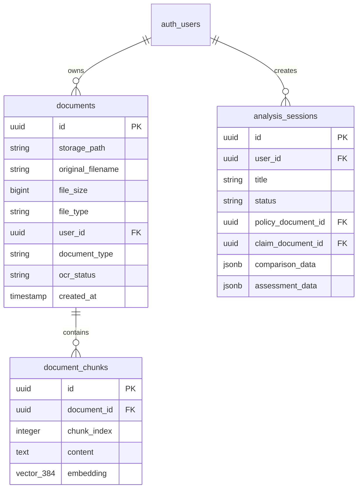

# 🧠 Claims Copilot

> An AI-powered insurance assistant that turns complex insurance documents into clear, grounded answers you can actually trace back to the source.

[Architecture](#-architecture) • [RAG Pipeline](#-document-intelligence-pipeline) • [How AI Works](#-how-the-ai-works) • [Getting Started](#-getting-started) • [Deep Dive Docs](docs/README.md)

---

## 📌 Overview

Insurance documents are inherently complex. Critical details regarding coverage limits, deductibles, exclusions, and reporting deadlines are often spread across lengthy policy schedules, claim forms, damage estimates, and supporting receipts.

**Claims Copilot** bridges this gap. By combining multi-format document processing (PDF parsing and OCR) with high-dimensional vector embeddings, fast vector search (`pgvector`), and grounded LLM generation, Claims Copilot delivers precise, evidence-backed answers directly linked to uploaded document sources.

---

## ✨ What It Does

- 📄 **Multi-Format Document Ingestion** — Upload insurance policies, claim forms, receipts, or estimates in PDF format (via `unpdf`) or image formats (`PNG`/`JPEG` via `tesseract.js` OCR).
- 🧠 **Vector Embeddings & Storage** — Automatically chunks text into ~2,000-character segments with 200-character overlap and generates 384-dimensional vector embeddings using Hugging Face's `BAAI/bge-small-en-v1.5` model.
- 🔎 **Retrieval-Augmented Generation (RAG)** — Queries vector representations stored in Supabase Postgres using custom RPC functions (`match_document_chunks`) with strict Row-Level Security (RLS) enforcement.
- 💬 **Grounded AI Copilot** — Powered by Groq LLMs (`openai/gpt-oss-120b`), generating concise (1–3 sentence) answers strictly constrained to retrieved document context with zero hallucinations.
- 📌 **Traceable Citations & Confidence Scoring** — Every AI response includes exact source document citations, chunk indices, page numbers, and a confidence rating (`high`, `medium`, `low`).
- 📊 **Interactive Analysis** — Run quick analysis tasks (Coverage & Deductible Assessment, Exclusions Check, Missing Documentation Audit, Estimate & Discrepancy Reporting) across all uploaded files.
- 🧾 **Claim Timeline** — Track event progression and milestones (e.g., incident date, policy effective period, claim submission) in a clean visual timeline.
- 💾 **Analysis History** — Save completed analyses, review detailed findings, export reports as plain text files, or continue past analysis sessions.
- 🔐 **Isolated User Data** — Secured with Supabase Authentication and database RLS policies to ensure user data remains completely private and isolated.

---

## 🎯 Product Flow

```
Upload Document ➔ Extract & Chunk ➔ Generate Embeddings ➔ Ask Question ➔ Retrieve Context ➔ Grounded Answer ➔ Track & Analyze
```

1. **Upload**: User uploads an insurance policy or claim document (PDF, PNG, or JPEG).
2. **Process**: Server extracts text, splits it into overlapping chunks, generates embeddings, and persists metadata.
3. **Ask**: User submits a query in the AI Copilot chat interface.
4. **Retrieve**: System performs vector cosine similarity search over the user's chunk library.
5. **Answer**: LLM synthesizes a grounded answer using *only* the retrieved context and attaches source citations.
6. **Analyze & Track**: User runs automated coverage audits or tracks claim milestones in the Claim Timeline.

---

## 🏗️ Architecture

Claims Copilot is built on a modern Next.js 16 (App Router) frontend and API layer, backed by Supabase for authentication, storage, and vector database persistence.



For detailed architectural flowcharts and sequence diagrams, explore [docs/README.md](docs/README.md).

---

## 📄 Document Intelligence Pipeline

Whenever a document is uploaded via `/api/documents/upload`:

```mermaid
flowchart LR
    A["📄 Upload File"] --> B{"File Type?"}
    B -->|"PDF"| C["`unpdf` Extraction"]
    B -->|"PNG / JPEG"| D["`tesseract.js` OCR"]
    C & D --> E["Text Chunking (~2000 chars)"]
    E --> F["Hugging Face Embedding (384-dim)"]
    F --> G["Batch Insert to `document_chunks`"]
    G --> H["Status: Complete"]
```

1. **Validation**: Enforces maximum file size (10 MB) and accepted MIME types (`application/pdf`, `image/png`, `image/jpeg`).
2. **Storage**: Saves original binary file to Supabase Storage in a path partitioned by `user_id`: `{user_id}/{uuid}-{filename}`.
3. **Record Creation**: Creates a `documents` database record with `ocr_status = 'processing'`.
4. **Text Extraction**: Uses `unpdf` for vector PDFs and `tesseract.js` engine for images.
5. **Text Chunking**: Breaks extracted text into standard chunks of ~2,000 characters with 200-character overlap to retain context across boundaries.
6. **Vector Embedding**: Sends chunks to Hugging Face (`BAAI/bge-small-en-v1.5`) with automatic retry & backoff logic to generate 384-dimensional vector embeddings.
7. **Database Storage**: Batch inserts chunks and vectors into `document_chunks` table (`vector(384)` column).
8. **Completion**: Updates document `ocr_status` to `'complete'`.

---

## 🤖 How the AI Works

Claims Copilot implements Retrieval-Augmented Generation (RAG) designed specifically to eliminate model hallucinations:

```mermaid
sequenceDiagram
    autonumber
    User->>Client: Type question in AI Copilot
    Client->>/api/chat: Send message payload
    /api/chat->>Hugging Face: Embed user question (384-dim)
    Hugging Face-->>/api/chat: Return vector
    /api/chat->>Supabase RPC: Call match_document_chunks(vector, topK=5)
    Supabase RPC-->>/api/chat: Return top similarity chunks (with user_id check)
    /api/chat->>Groq API: Call LLM with strict grounded prompt + retrieved chunks
    Groq API-->>/api/chat: 1-3 sentence grounded response
    /api/chat-->>Client: Answer + confidence rating + cited sources
```

### System Prompt Constraints
- **Strict Grounding**: Answer using ONLY retrieved context snippets.
- **Conciseness**: Return answers directly in 1–3 sentences.
- **No Speculation**: If context is missing, explicitly answer: *"The documents do not provide enough information to answer this question."*
- **Conflict Handling**: Explicitly flag conflicts when policy text and claim details contradict each other.

---

## 🗂️ Application Structure

```
claims-copilot/
├── docs/                        # Architectural documentation & sequence diagrams
│   └── README.md
├── scripts/                     # Automated testing & verification scripts
│   ├── verify-phase13.ts
│   ├── verify-phase14.ts
│   ├── verify-phase15.ts
│   └── test-e2e.ts
├── src/
│   ├── app/                     # Next.js App Router (pages & API routes)
│   │   ├── (auth)/              # Authentication routes (/signup)
│   │   ├── api/                 # Serverless API endpoints
│   │   │   ├── analysis-sessions/
│   │   │   ├── chat/
│   │   │   ├── documents/
│   │   │   └── test-login/
│   │   ├── login/               # Sign-in page
│   │   ├── globals.css          # Design system & Tailwind CSS v4 setup
│   │   ├── layout.tsx           # Main application root layout
│   │   └── page.tsx             # View router component
│   ├── components/              # UI components by domain
│   │   ├── analysis/            # AnalysisView & Saved Analysis cards
│   │   ├── auth/                # LoginForm & SignupForm
│   │   ├── chat/                # ChatWindow, ChatMessage, SourceCard
│   │   ├── dashboard/           # DashboardView & Quick Actions
│   │   ├── documents/           # DocumentsView & DocumentUploadModal
│   │   ├── settings/            # SettingsView & profile info
│   │   ├── sidebar/             # Sidebar navigation & conversations list
│   │   └── timeline/            # TimelineView & claim event tracking
│   ├── context/                 # Application state (AppContext.tsx)
│   ├── lib/                     # Core library utilities
│   │   ├── rag/                 # Embedding (embed.ts) & Retrieval (retrieve.ts)
│   │   ├── supabase/            # Supabase SSR, Client, Server, Admin clients
│   │   └── documents-store.ts   # Document management helper store
│   └── types/                   # TypeScript domain models & Zod schemas (index.ts)
└── supabase/
    └── migrations/              # PostgreSQL schema & RLS migrations
```

---

## 🧩 Key Components & Technologies

| Technology / Component | Responsibility in Claims Copilot |
|---|---|
| **Next.js 16 (App Router)** | Framework providing UI rendering, server components, and API routing. |
| **React 19 & Context API** | Client-side state management (`AppContext`) and dynamic view switching. |
| **Supabase Auth & SSR** | User authentication, session persistence, and server-side cookie management. |
| **Supabase Postgres & RLS** | Relational metadata storage with strict Row-Level Security on every table. |
| **pgvector** | PostgreSQL extension storing 384-dimensional chunk vector embeddings. |
| **Hugging Face Inference API** | Embedding generation using model `BAAI/bge-small-en-v1.5`. |
| **Groq Inference API** | Ultra-fast LLM generation using model `openai/gpt-oss-120b`. |
| **`unpdf`** | Lightweight, zero-dependency PDF text extraction engine. |
| **`tesseract.js`** | Client/server optical character recognition (OCR) for image files (`PNG`/`JPEG`). |
| **Zod** | Schema validation for structured analysis output. |
| **Tailwind CSS v4** | Neo-brutalist styling system with bold borders, crisp shadows, and high contrast. |

---

## 🗄️ Data Model

### Core Entities



---

## 🔐 Security & Data Isolation

- **Authentication**: All API routes (`/api/documents/*`, `/api/chat`, `/api/analysis-sessions/*`) require a valid authenticated Supabase session (`auth.getUser()`).
- **Row-Level Security (RLS)**: Enforced directly at the database layer. Users can only select, insert, update, or delete rows where `user_id = auth.uid()`.
- **Vector RPC Security**: The `match_document_chunks` function explicitly joins the `documents` table and checks `documents.user_id = auth.uid()` to prevent unauthorized vector retrieval across tenants.
- **Server-Side API Key Protection**: Service Role keys, Groq API keys, and Hugging Face tokens are restricted to server-side code and are never exposed to the client.

---

## 🧪 Verification & Testing

### Verification Commands

```bash
# 1. Typecheck TypeScript files without emitting code
npx tsc --noEmit

# 2. Run ESLint code checks
npm run lint

# 3. Test production build execution
npm run build
```

### Integration Test Scripts

The project includes pre-configured integration verification scripts in the `scripts/` folder:

```bash
# Verify API authentication and document handling
npx tsx scripts/verify-upload.ts

# Run phase verification suites
npx tsx scripts/verify-phase13.ts
npx tsx scripts/verify-phase14.ts
npx tsx scripts/verify-phase15.ts

# Execute end-to-end flow test
npx tsx scripts/test-e2e.ts
```

---

## 🚀 Getting Started

### Prerequisites

- **Node.js**: `v18.x` or higher
- **npm**: `v9.x` or higher (or `pnpm`/`yarn`)
- **Supabase Instance**: Project with `pgvector` extension enabled
- **API Keys**: Groq API Key & Hugging Face Access Token

### Installation

1. **Clone the repository**:
   ```bash
   git clone https://github.com/sadiyasyed28/claims-copilot.git
   cd claims-copilot
   ```

2. **Install dependencies**:
   ```bash
   npm install
   ```

3. **Configure Environment Variables**:
   Create a `.env.local` file in the root directory:

   ```env
   # Supabase Configuration
   NEXT_PUBLIC_SUPABASE_URL=https://your-supabase-project.supabase.co
   NEXT_PUBLIC_SUPABASE_ANON_KEY=your_supabase_anon_key
   SUPABASE_SERVICE_ROLE_KEY=your_supabase_service_role_key

   # AI Provider API Keys
   GROQ_API_KEY=your_groq_api_key
   HUGGINGFACE_API_KEY=your_huggingface_api_key
   ```

4. **Database Setup**:
   Execute the migration SQL scripts located in `supabase/migrations/` in order against your Supabase SQL Editor:
   - `20260826_create_tables.sql` (Creates `documents` & `document_chunks` with `vector(384)`)
   - `20260825_add_match_document_chunks.sql` (Creates the vector retrieval RPC function)
   - `20260826182100_create_analysis_sessions.sql` (Creates `analysis_sessions`)

5. **Start Development Server**:
   ```bash
   npm run dev
   ```
   Navigate to [http://localhost:3000](http://localhost:3000) in your browser.

---

## 🧪 Testing the Full RAG Flow

Follow this manual walkthrough to test the end-to-end pipeline:

1. **Register / Sign In**: Create a new account or log in via the `/login` screen.
2. **Upload a Document**:
   - Go to **Documents** in the sidebar.
   - Click **+ Upload Document**.
   - Select an insurance document (PDF or image).
   - Verify that the OCR processing status transitions to **Complete**.
3. **Ask the Copilot**:
   - Navigate to **AI Copilot**.
   - Ask a question specifically answered by your uploaded document (e.g., *"What is the deductible limit stated in my policy?"*).
   - Confirm that the assistant returns a concise answer grounded in your document.
   - Inspect the **Sources** drawer to verify chunk text, file name, and similarity rating.
4. **Run an Analysis**:
   - Navigate to **Analysis**.
   - Click **Coverage & Deductible Assessment** or type a custom prompt.
   - Review the saved result in **Analysis History** and test **Export**.
5. **Track Milestones**:
   - Navigate to **Claim Timeline** to record milestones for your claim.

---

## 🗺️ Current Product Navigation

The application navigation features 6 core views:

- ◈ **Dashboard** — Application overview, recent document activity, and quick AI triggers.
- ▧ **Documents** — Upload, inspect, filter, and manage policy and claim files.
- ◆ **AI Copilot** — Grounded interactive AI chat interface with citation inspection.
- ⊞ **Analysis** — Structured document auditing, discrepancy detection, and saved history.
- ◎ **Claim Timeline** — Event timeline tracking for claims progression.
- ◧ **Settings** — Profile configuration and account preferences.

---

## 🧭 Roadmap

- ✅ **Phase 1: Multi-Format Ingestion** — Support for PDF text parsing (`unpdf`) and image OCR (`tesseract.js`).
- ✅ **Phase 2: Vector Search Engine** — 384-dimensional embeddings (`BAAI/bge-small-en-v1.5`) with Supabase `pgvector` RPC retrieval.
- ✅ **Phase 3: Grounded AI Copilot** — Groq LLM integration with strict context-bounded prompts and source citations.
- ✅ **Phase 4: Structured Analysis & History** — Coverage assessment, discrepancy auditing, saved analyses, and TXT report export.
- ✅ **Phase 5: Claim Timeline** — Interactive claim milestone and event progression tracking.
- 🚧 **In Progress**: Advanced multi-document side-by-side comparison visualization.
- 🔜 **Planned**: Automated email notification digest for upcoming claim reporting deadlines.

---

## 🏆 Why This Project Is Interesting

Most standard AI demos focus simply on "chatting with a PDF." **Claims Copilot** goes further by addressing real-world domain requirements in insurance tech:

1. **Zero Hallucination Tolerance** — Insurance answers must be accurate. Grounding every response strictly in vector-retrieved text snippets prevents dangerous model assumptions.
2. **True Source Traceability** — Users can verify every line of an AI response against exact document page numbers and chunk text.
3. **Privacy & Data Security** — Multi-tenant database RLS policies guarantee user documents and vector embeddings remain completely private.

---

## 🧠 Design Principles

- **Grounding over Guesswork**: Never output an answer without verifiable document evidence.
- **Zero Fluff UI**: Neo-brutalist functional aesthetic built for speed, contrast, and clarity.
- **Privacy by Construction**: RLS policies enforce isolation at the database layer.
- **Traceable Intelligence**: Every assertion connects back to a specific document chunk.

---

## 🤝 Contributing

Contributions are welcome! Please follow these guidelines:

1. Create a feature branch: `git checkout -b feature/your-feature-name`.
2. Keep changes focused and well-documented.
3. Ensure no credentials or `.env` files are committed.
4. Run `npx tsc --noEmit`, `npm run lint`, and `npm run build` to verify code quality before opening a Pull Request.

---

## 📜 License

No explicit license is currently specified for this repository. All rights reserved.
