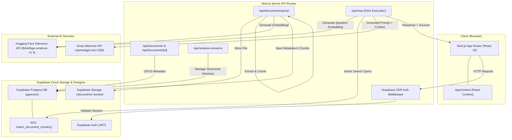
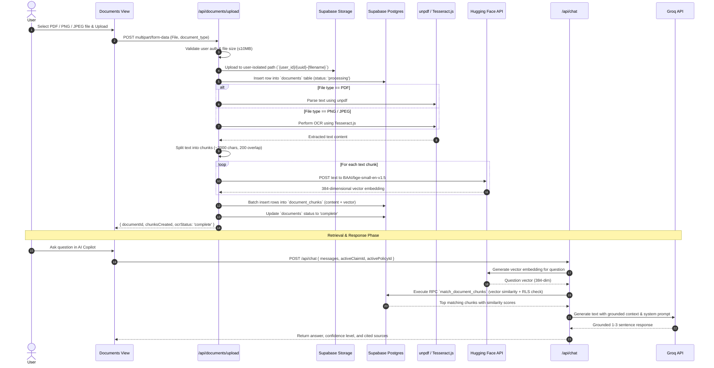
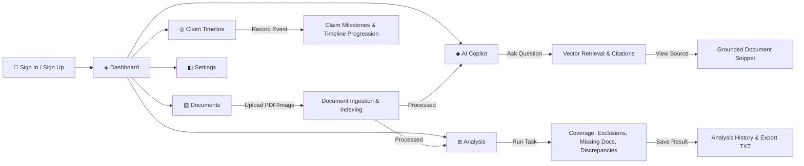
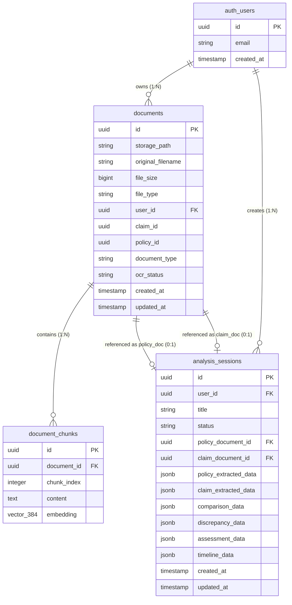
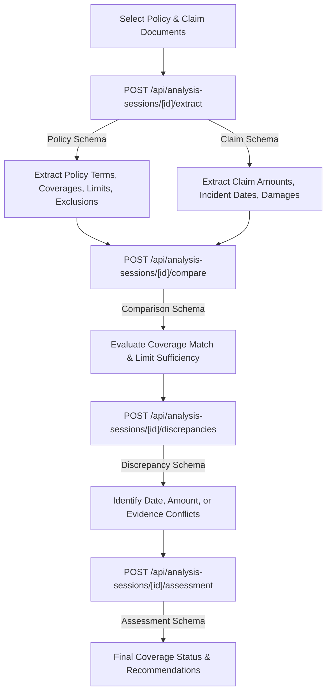

# 🏛️ Claims Copilot — Architecture & Deep Dive

This document provides in-depth technical documentation, architectural sequence diagrams, and database schemas for **Claims Copilot**.

---

## 📑 Table of Contents

1. [System Architecture](#1-system-architecture)
2. [Document → RAG Pipeline](#2-document--rag-pipeline)
3. [User Navigation & Flow](#3-user-navigation--flow)
4. [Database ER Diagram](#4-database-er-diagram)
5. [Structured Analysis Flow](#5-structured-analysis-flow)

---

## 1. System Architecture

The following diagram illustrates the high-level architecture of Claims Copilot, showing interactions between the Next.js frontend/backend, Supabase services, vector embeddings engine, and LLM inference provider.

---

## 2. Document → RAG Pipeline

Below is the end-to-end data transformation pipeline when a user uploads an insurance policy or claim document.

---

## 3. User Navigation & Flow

The user interface follows a streamlined navigation structure focused on document analysis, grounded chat, and claim timeline management.

---

## 4. Database ER Diagram

The database schema enforced via Supabase migrations uses PostgreSQL with the `pgvector` extension.

---

## 5. Structured Analysis Flow

For multi-step document verification (comparing policy rules against submitted claim details), the application uses Zod schemas to guarantee structured JSON output.

